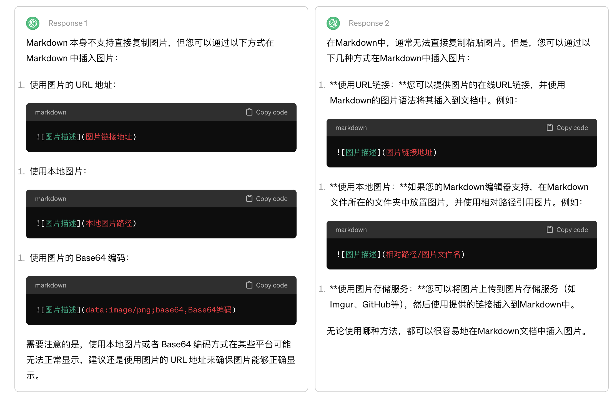

# 学习说明

## 读书

## 管理

## 其他

## T恤网站简单对比

###### 以下是十个网站定制1-3件T恤的收费起步价。

|网站 | 1件 | 2件 | 3件 |
| :-----| ----: | :----: | :----: |
| [Zazzle](https://www.zazzle.com)| 20.1 | 40.2 | 80.4 |
| [Allied Shirts](https://www.alliedshirts.com/) | 27.19 | 54.26 | 99.16 |

Money = Sarlary is a job work

### 账号

本地wordpress

后台地址：http://localhost:8888/wp-admin/
用户名：yeheic
密码：H!s3x4#M&S(riBQlGb

# 折线图展示

### z-chart
z-chart组件是基于echarts的组件，只需要设置父容器的宽高，再设置 options 值即可。
<!-- markdown文档里插入vuep代码 -->

<vuep template="#basicBar"></vuep>

> An awesome project.
